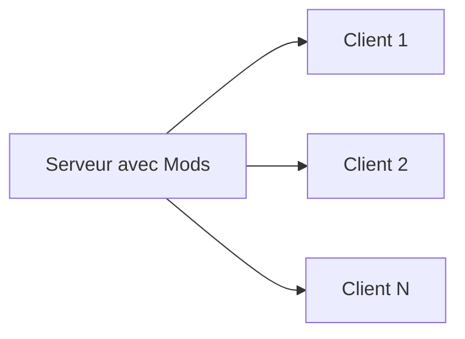

# Architecture du Modding

Hytale utilise une architecture unique **serveur-first** pour toutes les modifications.

## Execution Cote Serveur

Tous les mods s'executent sur le serveur :

### Avantages

- Les joueurs n'installent pas de mods
- Changement de serveur transparent
- Securite renforcee
- Mises a jour instantanees des mods

## Comment ca Fonctionne

1. Le joueur se connecte au serveur
2. Le serveur transmet les assets requis
3. Le client affiche le contenu
4. Toute la logique s'execute cote serveur

## Types de Mods

Hytale supporte trois types de mods distincts, chacun ciblant differents niveaux de competences :

| Type | Description | Competences Requises |
|------|-------------|---------------------|
| **Packs** | Packs d'assets pour nouveaux blocs, mobs, items | Aucun code - Asset Editor |
| **Plugins** | Mods ecrits en Java utilisant l'API du jeu | Programmation Java |
| **Bootstrap Plugins** | Plugins bas niveau pour transformation de bytecode | Java avance |

## Langages et Scripting

### Position Officielle

Hypixel Studios a officiellement decide de **ne pas supporter Lua ou Python** pour le modding. A la place, les options suivantes sont disponibles :

- **Scripting Visuel** via Node Editor (inspire des Blueprints d'Unreal Engine)
- **Asset Graph Editor** integre avec rechargement en temps reel
- **Plugins Java** necessitant Java 25 (Adoptium recommande)

### Code Source Serveur

Le code source du serveur est prevu **1-2 mois apres le lancement**, donnant aux developpeurs un acces complet aux mecanismes internes du jeu.

## Outils de Developpement

### Outils Officiels

| Outil | Objectif | Statut |
|-------|----------|--------|
| **Hytale Asset Editor** | Editeur principal pour les data assets | Disponible |
| **Hytale Node Editor** | Scripts visuels pour brushes et world gen | Disponible |
| **Plugin Blockbench** | Creer des modeles 3D et animations | Disponible |
| **Machinima** | Enregistrement de contenu | Disponible |
| **World Tools** | Modification/edition de monde | Disponible |

### Plugin Blockbench

Le plugin Blockbench remplace l'ancien Hytale Model Maker :

- **Formats :** `.blockymodel` et `.blockyanim`
- **GitHub :** [https://github.com/JannisX11/hytale-blockbench-plugin](https://github.com/JannisX11/hytale-blockbench-plugin)

## Formats de Fichiers

| Type | Format |
|------|--------|
| Data Assets | JSON |
| Modeles | `.blockymodel` |
| Animations | `.blockyanim` |
| Plugins | `.jar` |
| Configuration | `config.json`, `permissions.json` |

## Distribution

**CurseForge** est le partenaire de distribution officiel (depuis le 5 janvier 2026) :

- **Commission 0%** sur les mods et serveurs pendant les 2 premieres annees
- Plateforme officielle pour decouvrir et partager du contenu

## Implications pour les Developpeurs

- Concevez en pensant aux performances du serveur
- Optimisez la taille des assets
- Implementez la validation cote serveur
- Testez avec plusieurs joueurs simultanes

## Prochaines Etapes

- [Data Assets](/docs/modding/data-assets/overview)
- [Plugins Java](/docs/modding/plugins/overview)
