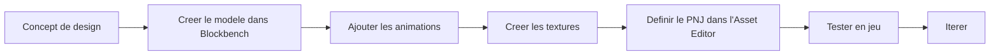

# Apercu des outils de developpement

Hytale fournit une suite complete d'outils pour la creation de contenu, de la modelisation 3D a l'edition en jeu. Selon la [Strategie de modding](https://hytale.com/news/2025/11/hytale-modding-strategy-and-status) officielle, Hypixel Studios vise a fournir les memes outils utilises en interne par l'equipe de developpement.

## Outils integres au jeu

Hytale inclut plusieurs outils puissants directement dans le jeu, permettant aux createurs de modifier et creer du contenu sans quitter l'environnement de jeu.

### Editeur d'assets

L'editeur principal pour les assets de donnees, permettant de modifier les Packs sans aucun code.

**Fonctionnalites :**
- Editer des blocs, objets, PNJ et autre contenu de jeu
- Interface graphique pour modifier les Packs sans coder
- Hot reloading - voir les changements instantanement en jeu
- Aucune connaissance en programmation requise

**Limitations :**
- Certains types d'assets ne sont pas encore completement supportes
- Les editeurs de PNJ et de generation de monde sont encore en amelioration

[Guide de l'editeur d'assets](/docs/tools/asset-editor/overview)

### World Tools

Outils de modification et d'edition de monde directement en jeu.

**Fonctionnalites :**
- Modification de terrain
- Capacites d'edition de monde
- Integration avec le mode creatif

### Visual Scripting

Un systeme de script visuel inspire des Blueprints d'Unreal Engine.

**Fonctionnalites :**
- Programmation par noeuds sans ecrire de code
- Creer des comportements personnalises et de la logique de jeu
- Accessible aux non-programmeurs

### Node Editor

Editeur base sur des noeuds pour les pinceaux et les systemes de generation de monde.

**Fonctionnalites :**
- Edition visuelle par graphe pour les systemes complexes
- Creer des regles de generation de monde personnalisees
- Concevoir des pinceaux scriptes

:::note En developpement
Le Node Editor est actuellement decrit comme "non poli" mais fonctionnel. Il sera ameliore avec le temps.
:::

### Pinceaux scriptes

Pinceaux proceduraux pour creer du terrain et des structures.

**Exemples :**
- Generation de montagnes
- Creation de chemins
- Placement de ruines et structures
- Contenu procedural personnalise

### Outil de selection

Outil de selection avance pour l'edition de monde.

**Fonctionnalites :**
- Selectionner des regions dans l'espace 3D
- Copier, coller et manipuler les selections
- Fonctionne avec les autres outils d'edition de monde

### Prefabs

Structures pre-construites reutilisables.

**Fonctionnalites :**
- Sauvegarder et charger des structures personnalisees
- Partager des prefabs entre les mondes
- Editer des prefabs dans un environnement separe
- Plus de 100 modeles de prefabs disponibles

### Outils Machinima

Creer des cinematiques et des videos avec une animation de camera basee sur des images cles.

**Fonctionnalites :**
- **Acteur camera** : Creer des entites camera avec animation par images cles
- Definir des trajectoires, vitesses et comportements personnalises
- Creer des sequences cinematiques pour les bandes-annonces et le contenu

> "Les outils Machinima ont beaucoup plus de fonctionnalites que celles presentees dans les demos rapides, et ils sont prevus pour une mise a niveau massive en termes de fonctionnalites et d'experience utilisateur dans les mois suivant le lancement."
> -- [Mode creatif Hytale](https://hytale.com/news/2025/11/hytale-creative-mode)

[Guide Machinima](/docs/tools/machinima)

## Mode creatif

Disponible au lancement, le mode creatif donne acces a tous les outils de creation.

> "En passant en mode creatif dans votre monde, vous pouvez voler et explorer, creer, editer, faire exploser des choses, et plus encore."
> -- Ktar, Ingenieur Mode Creatif

**Fonctionnalites :**
- Acces illimite a tous les blocs
- Outils de construction avances
- Changeur de modele de personnage (plus de 100 modeles de PNJ)
- Tous les outils de creation disponibles
- **Pinceau** : Peindre des formes (pyramides, cones, carres) avec des materiaux, densite et masques personnalisables
- **Systeme de prefabs** : Charger et editer des prefabs dans un environnement d'edition separe
- **Vol personnalisable** : Ajuster la vitesse, les controles, le mode de vol (stationnaire/directionnel) et l'inertie
- Selection et copier/coller

[Guide du mode creatif](/docs/tools/creative-mode)

## Outils externes

### Blockbench + Plugin Hytale

L'outil officiel pour creer des modeles 3D et des animations. Blockbench remplace l'outil interne "Hytale Model Maker" pour mieux supporter les workflows creatifs etablis dans la communaute.

> "Nous supportons officiellement Blockbench pour creer des modeles, textures et animations Hytale."
> -- [Strategie de modding Hytale](https://hytale.com/news/2025/11/hytale-modding-strategy-and-status)

**Fonctionnalites :**
- Creer des fichiers `.blockymodel` avec des ratios de pixels coherents
- Animer avec le format `.blockyanim`
- Support de la hierarchie des os
- Export en direct vers des formats compatibles Hytale
- Ameliorations de qualite de vie pour le workflow Hytale

**Installation :**
1. Telecharger [Blockbench](https://www.blockbench.net/)
2. Installer le [plugin Hytale](https://github.com/JannisX11/hytale-blockbench-plugin) depuis le gestionnaire de plugins

**Ressources officielles :**
- [Une introduction a la creation de modeles pour Hytale](https://hytale.com/news/2025/12/an-introduction-to-making-models-for-hytale)
- [Depot GitHub](https://github.com/JannisX11/hytale-blockbench-plugin)

[Guide Blockbench](/docs/tools/blockbench/installation)

### Recommandations d'IDE

| IDE | Ideal pour | Cout |
|-----|----------|------|
| IntelliJ IDEA | Plugins Java | Gratuit (Community) |
| VS Code | Edition JSON, general | Gratuit |
| Eclipse | Plugins Java | Gratuit |

### Controle de version

Utilisez Git pour gerer vos projets :

```bash
git init
git add .
git commit -m "Initial commit"
```

### Editeurs d'images

Pour la creation de textures :

- [GIMP](https://www.gimp.org/) - Gratuit, complet
- [Aseprite](https://www.aseprite.org/) - Specialise pixel art
- Photoshop - Standard de l'industrie

## Comparaison des outils

| Tache | Outil recommande |
|------|-----------------|
| Modeles 3D | Blockbench |
| Animations | Blockbench |
| Textures | GIMP / Photoshop |
| Donnees JSON | Asset Editor / VS Code |
| Plugins Java | IntelliJ IDEA |
| Construction de monde | Mode creatif + World Tools |
| Script visuel | Visual Scripting en jeu |
| Cinematiques | Outils Machinima |

## Exemple de workflow

Creation d'une creature personnalisee :



## Formats de fichiers

| Format | Utilisation | Outil |
|--------|---------|------|
| `.blockymodel` | Modeles 3D | Blockbench |
| `.blockyanim` | Animations | Blockbench |
| `.json` | Assets de donnees | Asset Editor |
| `.png` | Textures | Editeur d'image |
| `.jar` | Plugins Java | IDE |

## Pour commencer

<div className="doc-card-grid">
  <DocCard item={{
    type: 'link',
    label: 'Configuration de Blockbench',
    href: '/docs/tools/blockbench/installation',
    description: 'Installer et configurer Blockbench'
  }} />
  <DocCard item={{
    type: 'link',
    label: 'Editeur d\'assets',
    href: '/docs/tools/asset-editor/overview',
    description: 'Apprendre l\'editeur integre'
  }} />
  <DocCard item={{
    type: 'link',
    label: 'Mode creatif',
    href: '/docs/tools/creative-mode',
    description: 'Outils de construction de monde'
  }} />
</div>
